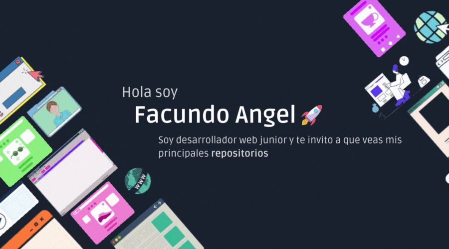

# Sobre mi
Soy estudiante de ingeniería en informatíca y paralelamente me mantengo en aprendizaje por medio de cursos y capacitaciones referidas al desarrollo web. Particularmente estoy mas especializado en lo que es el Frontend sin embargo he hecho desarrollos en el Backend haciendo algunas Apis Rest. Me considero flexible siempre dispuesto a actualizarme y mejorarme a mi mismo
